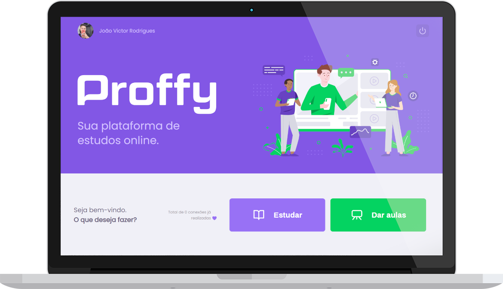

  
 

## 🚀 Tecnologias

Esse projeto foi desenvolvido com as seguintes tecnologias:

- [Node.js](https://nodejs.org/en/)
- [React](https://reactjs.org)
- [React Native](https://facebook.github.io/react-native/)
- [Expo](https://expo.io/)
- [TypeScript](https://www.typescriptlang.org/)

## 💻 Projeto

O Proffy é uma aplicação com o objetivo de ajudar alunos e professores a se conectarem,
na aplicação poderão tanto estudar como dar aulas, tendo como meio de comunicação o Whatasapp. Feito durante o evento Next Level Week 2.

## 📁 Scripts

Para rodar o servidor utilize o comando:
- yarn start

Para rodar a aplicação web utilize:
- yarn start

## 📚  Desafio 2.0

Aqui está uma parte dos desafios feitos,

- Página de login e autenticação
- Página de cadastro
- Página de Dashboard
- Perfil do usuário
- Listagem de professores
- Formulário para lecionar uma nova aula

 

 
<h2> Aqui algumas telas da aplicação: </h2>
  
  Perfil </h1>
  

  

 

  Dashboard </h1>
  

  

 

 
<h2> 
Logo mais os desafios completos! 
 </h2>
